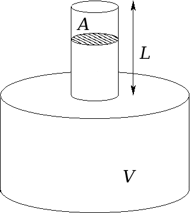
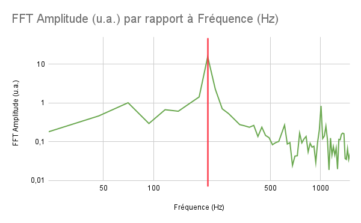
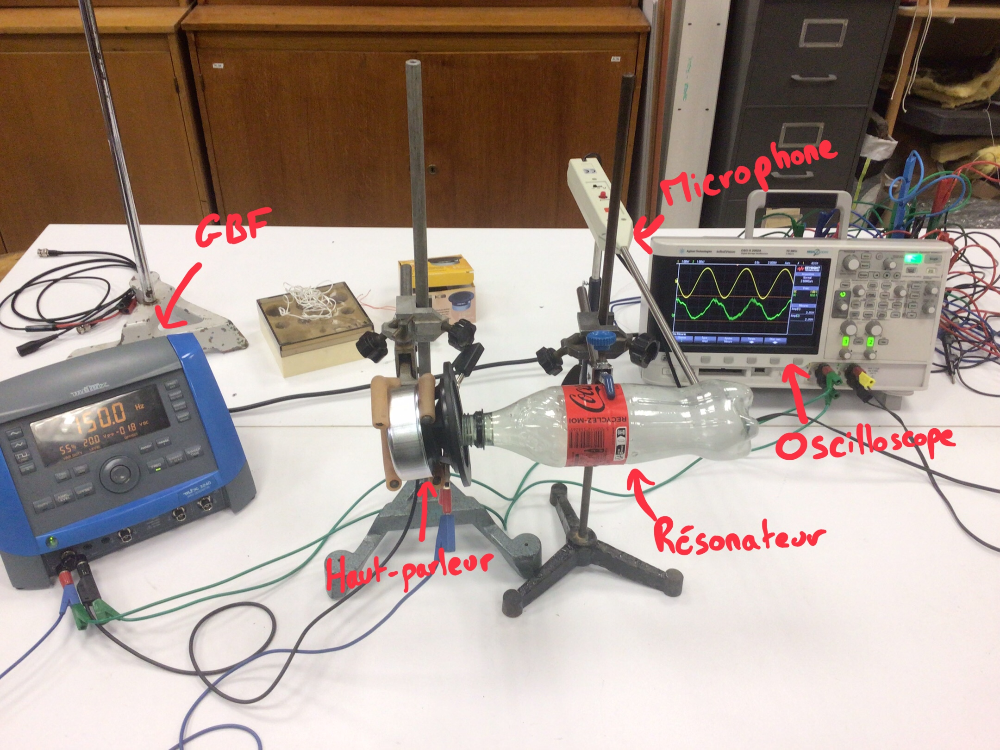

- [Introduction](#intro)
  - [Présentation du dispositif](#pres)
  - [Hypothèses](#hypotheses)
  - [Grandeurs et notations](#grandeurs)
- [Modélisation physique](#modele)
  - [Etude analytique du dispositif](#analytique)
- [Mise en œuvre expérimentale](#exp)
  - [Expérience 1](#exp1)
    - [Présentation](#pres1)
    - [Résultats](#res1)
  - [Expérience 2](#exp2)
    - [Présentation](#pres2)
    - [Résultats](#res2)
- [Simulation numérique](#sim)
  - [Présentation](#simpres)
  - [Simulation](#simsim)
  - [Résultats](#simres)

<h4 id="intro"></h4>

# Introduction

On étudie l'influence du résonateur de Helmholtz pour la réduction de bruit.

<h4 id="pres"></h4>

## Présentation du dispositif

On considère une cavité de volume **V** surmontée d'un col de longueur **L** et de surface **A**.

> 
> *Résonateur de Helmholtz*

<h4 id="hypotheses"></h4>

## Hypothèses

- Les longueurs d'ondes misent en jeu sont __grandes__ devant les dimensions du résonateur.
- Les gaz sont considérés __parfaits__.

<h4 id="grandeurs"></h4>

## Grandeurs et notations

| Symbole    | Signification            | Unité             |
| ---------- | ------------------------ | ------------------ |
| $V$        | Volume de la cavité     | $m^3$              |
| $L$        | Longueur du col          | $m$                |
| $A$        | Surface du col           | $m^2$              |
| $\rho$     | Masse volumique de l'air | $kg.m^3$           |
| $U$        | Débit                   | $m^3.s^{-1}$       |
| $Ma$       | Masse sonore             | $kg.m^{-4}$        |
| $Ra$       | Résistance sonore       | $kg.s^{-1}.m^{-4}$ |
| $Ca$       | Capacité sonore         | $m^4.s^2.kg^{-1}$  |
| $\omega_0$ | Pulsation propre         | $rad.s^{-1}$       |
| $f_0$      | Fréquence propre        | $Hz$               |
| $Q$        | Facteur de qualité      | -                  |

<h4 id="modele"></h4>

# Modélisation physique

<h4 id="analytique"></h4>

## Etude analytique du dispositif

On fait, en première approximation une hypothèse supplémentaire sur notre dispositif qui est que __toutes les transformations seront considérées isentropiques__.

On fait un bilan des forces exercées sur le col du résonateur :

- $\vec{F_{air/col}} = p_{0}A \vec x $
- $\vec{F_{enceinte/col}} = -p_1A \vec x$

On applique le principe fondamental de la dynamique au col et on a en projettant sur l'axe $x$ :

$$
\rho V \ddot{x}= (p_0-p_1)A \tag{1}
$$

D'après la Loi de Laplace, on a :

$$
p_1V^\gamma = p_0(V - V_{col})^\gamma \tag{2}
$$

Donc :

$$
p_0 = p_1(\frac{1}{1-\frac{Ax}{V}})^\gamma \tag{3}
$$

Or $Ax \ll V$ donc après un développement limité à l'ordre 1, on a $p_0 = p_1(1+\gamma\frac{Ax}{V})$

Donc, on obtient l'équation différentielle suivante :

$$
\rho V\ddot{x}+p_1\gamma\frac{A^2}{V}x=0 \tag{4}
$$

On reconnait ici l'équation d'un oscillateur harmonique que l'on met sous la forme :

$$
\ddot{x}+\omega_0^2x=0 \tag{5}
$$

où $\omega_0^2 = \frac{p_1\gamma A^2}{\rho V^2}$

De plus $c^2 = \frac{\gamma p_1}{\rho}$ et donc finalement $\omega_0^2 = \frac{cA}{V}^2 = \frac{c^2A}{VL}$.

Cette modélisation bien que très grossière est souvent suffisante lorsque l'amortissement est faible.
Cependant, pour une utilisation opérationnelle du résonateur, on s'attendrait à trouver un terme de dérivée d'ordre 1 représentant l'amortissement.

La modélisation précédente nous a tout de même permise de mettre en évidence une analogie avec les systèmes masses-ressorts.
De fait, il reste à tenir compte de la dissipation : comme le goulot est beaucoup plus étroit que la cavité, c'est là que la dissipation est la plus importante ; et comme c'est surtout l'effet d'inertie qui est important dans le goulot, il suffit d'ajouter une résistance en série dans le circuit fictif équivalent.

On introduit le débit $U = A \frac{dx}{dt}$ et on obtient l'équation :

$$
M_a\frac{dU}{dt} + R_aU + C_a\int U(t)dt = 0 \tag{6}
$$

Que l'on met sous la forme :

$$
\frac{d^2U}{dt^2} + \frac{\omega_0}{Q}\frac{dU}{dt} + w_0^2U(t) = 0 \tag{7}
$$

où on a :

$$
f_0 = \frac{1}{2\pi}\sqrt{\frac{1}{M_aC_a}} = \frac{c_0}{2\pi}\sqrt{\frac{S}{lV}} \tag{8}
$$

$$
Q = \frac{1}{R_a}\sqrt{\frac{M_a}{C_a}} = \frac{\rho}{R_a}\sqrt{\frac{l}{SV}} \tag{9}
$$

On a donc mis en évidence une fréquence propre de résonnance et un facteur de qualité qui ont les propriétés suivantes :

- La fréquence propre du résonnateur dépend exclusivement de sa géométrie
- Le facteur de qualité est inversement proportionnel aux frottements fluides du système

<h4 id="exp"></h4>

# Mise en oeuvre expérimentale

<h4 id="exp1"></h4>

## Expérience 1

<h4 id="pres1"></h4>

### Présentation

Dans cette expérience, on cherche à mettre en évidence un phénomène de résonnance au voisinage de la fréquence propre du dispositif.

En premier lieu, on réalise une mesure de la fréquence propre du résonateur. Pour ce faire, on excite de proche le col et on enregistre la réponse en faisant une analyse de Fourier, on obtient :

> 
>
> *On obtient donc une fréquence propre expérimentale $f_{0, e} = 210Hz$*

On réalise le montage suivant :

> 
>
> *Montage expérience 1*

où les dimensions du résonateur sont les suivantes:

| V ($m^3$)     | A ($m^2$) | L ($m$)                 |
| -------------- | --------- | ----------------------- |
| C'est pas cool | d'oublier | le résonateur chez soi |

En utilisant **(8)** on en déduit la fréquence propre théorique du résonateur qui vaut: $f_{0, t} = Mais oui c'est clair!$.

<h4 id="res1"></h4>

### Résultats
